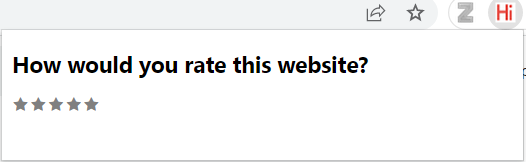

# Rating-Extension


## Contents

- [Overview](#overview)
- [Deployment](#deployment)

## Overview
Browser extension that accepts a rating for the current website from the user

## Deployment
For a detailed guide on how to use locally developed browser extensions you can go follow Google's official documentation [here](https://developer.chrome.com/docs/extensions/mv3/getstarted/development-basics/).


First clone the repository on a local directory.

Then go to the Extensions page by entering ```chrome://extensions``` in a new tab on Google Chrome.

Then enable Developer Mode by clicking the toggle switch next to Developer mode on the top right of the page.

Click the Load unpacked button on the top right of the page and select the extension directory. This should install the extension.

## Usage
When opening the extension you will see this page:



You are asked to give a rating from 1-5 for the website you are currently on. After clicking a star a rating is stored on a MongoDB Atlas cluster.