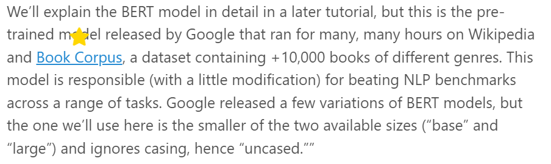

# Rating-Extension

## Contents

- [Rating-Extension](#rating-extension)
  - [Contents](#contents)
  - [Overview](#overview)
  - [Deployment](#deployment)
  - [Usage](#usage)
  - [Api](#api)

## Overview

Browser extension that accepts a rating for the current website from the user

## Deployment

1. Clone the repository on a local directory.
2. Go to the Extensions page by entering `chrome://extensions` in a new tab on Google Chrome.
3. Enable Developer Mode by clicking the toggle switch next to Developer mode on the top right of the page.
4. Click the Load unpacked button on the top right of the page and select the extension directory. This should install the extension.

For a detailed guide on how to use locally developed browser extensions you can go follow Google's official documentation [here](https://developer.chrome.com/docs/extensions/mv3/getstarted/development-basics/).

## Usage

When opening the extension you will see this page:

You are asked to give a rating from 1-5 for the website you are currently on. After clicking a star a rating is stored on a MongoDB Atlas cluster. No information is stored for the users, instead the users are kept in the MongoDB Atlas cluster with a random generated ID.

The extension send a request to the backend when a tab is selected. The backend responds with the prediction of the rating a user would give to the urls of the website based on their content (rating 1-5, 1 means the user would probably not be interested in the content, 5 means the user would probably be interested in the content of the url). When hovering over a url you can see the prediction number as stars.

Examples:

- Predicted rating 1:

- Predicted rating 5:

## Api

The backend exists in [this repo](https://github.com/Ptriantafyll/FlaskApi)
